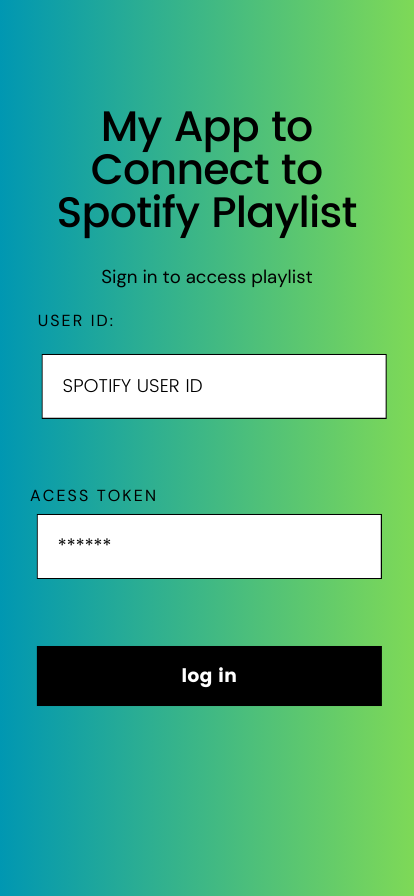

# Project Title

A dynamic website with user interaction and data from an external API

## Project Description

My project will require user interaction capturing inputted data. The data inputted will use Spotify API to fetch a user playlist and have a play button to play a random song from that playlist. The random song will then be placed into a certain area of the page creating that user a playlist.

## Screenshots

## Roadmap

[x] Create README for project

[x] Work on how you want the project to be visualize

[] Upload the visualization into README screenshots

[] Work on html to bring the vision to life

[] Start working on the interaction bringing the project to life

[] Add style to the project

## Features

- Users can enter their spotify ID, access token and play a random song from that playlist

- Spotify Web API

- The page will display a play button to play a song

- Creates a play list of the songs that are played

- Bootstrap will be use to help with the layout of the project

## Acknowledgements

- [Awesome Readme Templates](https://awesomeopensource.com/project/elangosundar/awesome-README-templates)

- <https://www.archbee.com/blog/readme-document-elements>

- <https://developer.spotify.com/documentation/web-api/reference/get-list-users-playlists>

## Author

- Louis Perkins

## License

[MIT](https://choosealicense.com/licenses/mit/)
